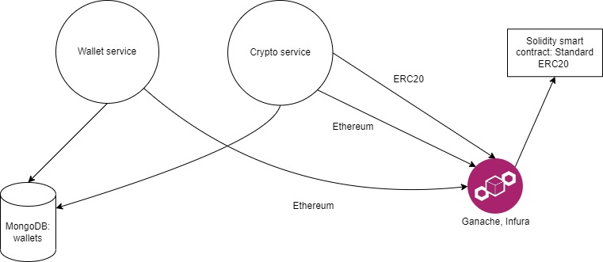

# Crypto and wallet services
Services for managing cryptocurrency wallets and transfer operations between platform and P2P wallets (Ethereum, ERC20))
------------------------------------------------------------------------------------------------------------------------
>This repository contains 2 services inside: Wallet service, Crypto service

## Table of contents

1.    **[About](#about)**
      1. *[Technologies stack](#technologies-stack)*
      2. *[Notes](#notes)*
3.    **[Services:](#services)**
      1.    *[Wallet](#wallet-service)*
      2.    *[Crypto](#crypto-service)*
3.    **[Scheme](#scheme)**
4.    **[Configuration](#configuration)**
5.    **[Maintainers](#maintainers)**


## ***About***

These services is about managing Ethereum and ERC20 token wallets, transfer operations between wallets *(platform and P2P)*. Both services use the same database, and
1 smart contract is included (Standard ERC20).

## ***Technologies stack***

The following technologies were used for the development of two services:
***    
   - **C#, .NET 6.0**
   - **Solidity**
   - **MongoDB**
   - **Docker**
***

## ***Notes***

    - The used database is MongoDB, since the stored wallets contain special keystores which are in json format. 
      Therefore, MongoDB is suitable for that scenario.
    - Solidity is used for writing smart contracts. In services, there were only one smart contract (Standard ERC20)
    - All services are run in Docker, along with other microservices.
    
# ***Services***

Here below will be given the description of each service.
***
  - ## ***Wallet service***

      Wallet service contains logic about managing Ethereum and ERC20 token wallets. While creating or loading wallet, there is created a P2P wallet - 
      which stores cryptocurrency for transfer purposes.
      
      - **Create wallet** - POST - *`/api/v1/wallets/create`*  
          Creates Ethereum wallet (Account) with zero balance and assigned private key and address. 
          Returns created wallet in the following JSON format (fields' values are random):
          
           ```
           {
               "address": "0xD2BE74365557b91070405d5007ed2922996CC5da",
               "privateKey": "e13461ef741ab5f0367707d7f0e539b11c2957888888727a8da26e9e60a9a19f",
               "id": "6277d227108472b96eee5e56"
            }
           ```
           
      - **Load wallet** - POST - *`/api/v1/wallets/load`*  
          Loads existing Ethereum wallet (account) of user. Scenario: User has Ethereum account in Metamask, and he wants to import it to our service.
          Returns loaded wallet, which is previously stored in database, in the same format, as in *Create wallet* endpoint.
          
          ```
           {
               "address": "0xD2BE74365557b91070405d5007ed2922996CC5da",
               "privateKey": "e13461ef741ab5f0367707d7f0e539b11c2957888888727a8da26e9e60a9a19f",
               "id": "6277d227108472b96eee5e56"
            }
           ```
          
      - **Get Ethereum wallet info** - GET - *`/api/v1/wallets/{id}/ethereum`*  
          Returns general information of Ethereum wallet: address, private key and balance in Ether:
          
          ```{
               "balance": 95.58789490,
               "privateKey": "e13461ef741ab5f0367707d7f0e539b11c2957888888727a8da26e9e60a9a19f",
               "address": "0xD2BE74365557b91070405d5007ed2922996CC5da"
             }
          ```
          
      - **Get ERC20 wallet info** - GET - *`/api/v1/wallets/{id}/erc20`*  
          Returns general information of ERC20 wallet: address and balance in ERC20 tokens:
          
          ```{
               "balance": 95.58789490,
               "address": "0xD2BE74365557b91070405d5007ed2922996CC5da"
             }
          ```
          
The detailed information is given in Swagger.
***          
  - ## ***Crypto service***

Crypto service contains logic about transfer of Ether and ERC20 between wallets. Main operations:  
1. local transfer between user's two wallets: platform wallet and P2P wallet. (*The platform and P2P wallet share the same id, so it's easier to operate.*)
2. Main transfer: from seller's P2P wallet to recipient's wallet.  

    ## Ethereum:  
      - **Transfer from user's platform wallet to P2P wallet** - POST - *`/api/v1/ethereum/transfer/to_p2p`*  
          Transfer ether from platform wallet to P2P wallet. Returns error message with 500 status code, or success message with 200 status code.  
          Sample request's format
           ```
           {
              "walletId": "some wallet's id in ObjectID format",
              "amount": 5
           }
           ```
           
      - **Refund from user's P2P wallet back to platform wallet** - POST - *`/api/v1/ethereum/transfer/refund`*  
          Refund obtained ether in P2P wallet back to platform's wallet. Returns error message with 500 status code, or success message with 200 status code.
          Sample request's format
          ```
           {
              "walletId": "some wallet's id in ObjectID format",
              "amount": 5
           }
          ```
          
      - **Transfer from user's P2P wallet to recipient's wallet** - POST - *`/api/v1/ethereum/transfer/from_p2p`*  
         Final transfer ether from P2P wallet of seller to buyer's wallet. Returns error message with 500 status code, or success message with 200 status code.
         Sample request's format
          ```
           {
              "walletId": "some wallet's id in ObjectID format",
              "recipientAddress": "Recipient's Ethereum account's address",
              "amount": 5
           }
          ```
      
     ##  ERC20:  
      - **Transfer from user's platform wallet to P2P wallet** - POST - *`/api/v1/erc20/transfer/to_p2p`*  
          Transfer tokens from platform wallet to P2P wallet. Returns error message with 500 status code, or success message with 200 status code.  
          Sample request's format
           ```
           {
              "walletId": "some wallet's id in ObjectID format",
              "amount": 5
           }
           ```
           
      - **Refund from user's P2P wallet back to platform wallet** - POST - *`/api/v1/erc20/transfer/refund`*  
          Refund obtained tokens in P2P wallet back to platform's wallet. Returns error message with 500 status code, or success message with 200 status code.
          Sample request's format
          ```
           {
              "walletId": "some wallet's id in ObjectID format",
              "amount": 5
           }
          ```
          
      - **Transfer from user's P2P wallet to recipient's wallet** - POST - *`/api/v1/erc20/transfer/from_p2p`*  
         Final transfer tokens from P2P wallet of seller to buyer's wallet. Returns error message with 500 status code, or success message with 200 status code.
         Sample request's format
          ```
           {
              "walletId": "some wallet's id in ObjectID format",
              "recipientAddress": "Recipient's Ethereum account's address",
              "amount": 5
           }
          ```
          
      - **Fund P2P wallet for ERC20** - POST - *`/api/v1/erc20/transfer/fund`*  
          For transferring ERC20 tokens, user's P2P wallet must have some ether on it for paying transaction fees. That's why it needs to be funded from  
          platform's wallet by some ether.
          Sample request's format
          ```
           {
              "walletId": "some wallet's id in ObjectID format",
              "amount": 5
           }
          ```
## ***Scheme***


## ***Configuration***

Configuration is stored in appsettings.json. Sample:  
```
"BlockchainConnections": {
    "Ropsten": "https://ropsten.infura.io/v3/bd61c504a9bc48828e100f7220c61a9a",
    "Kovan": "https://kovan.infura.io/v3/bd61c504a9bc48828e100f7220c61a9a",
    "Rinkeby": "https://rinkeby.infura.io/v3/bd61c504a9bc48828e100f7220c61a9a",
    "Goerli": "https://goerli.infura.io/v3/bd61c504a9bc48828e100f7220c61a9a",
    "Ganache": "http://127.0.0.1:7545"
  },
  "DatabaseSettings": {
    "ConnectionString": "mongodb://localhost:27017",
    "DatabaseName": "crypto_db",
    "EthereumWalletsCollection": "ether_wallets",
    "EthereumP2PWalletsCollection": "ether_p2p_wallets"
  },
  "SmartContractSettings": {
    "StandardERC20Address": "0x4D31Ad72308A90d20D71FD5D4D3f4EC52167C509"
  }
```
Pass the environment variables in the following format:  
`"Key1:Key2=Value"`. Example:  
`"DatabaseSettings:ConnectionString=mongodb://crypto_database:27027"`  

## ***Maintainers***

For any questions or issues of project contact [Fring02](https://github.com/Fring02).
